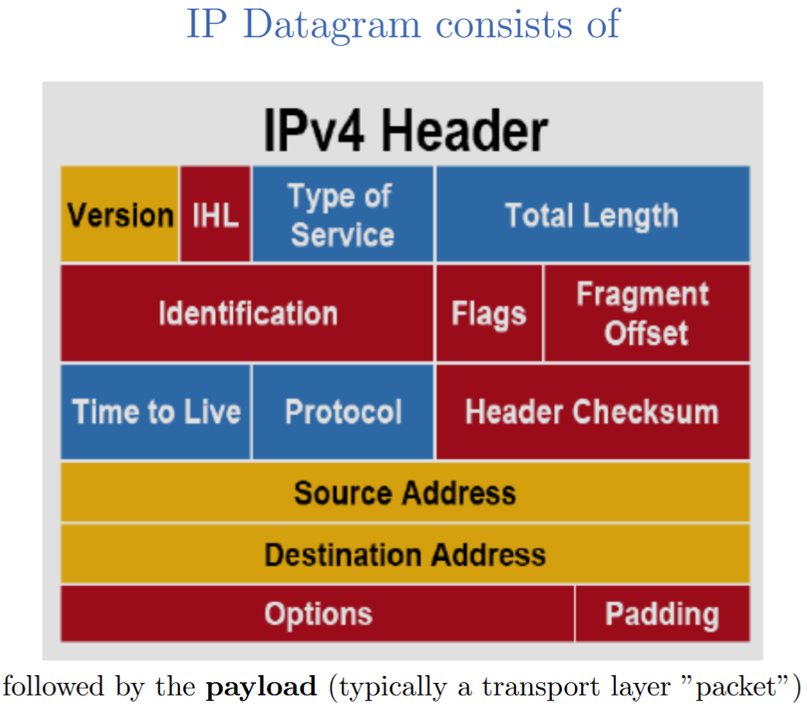
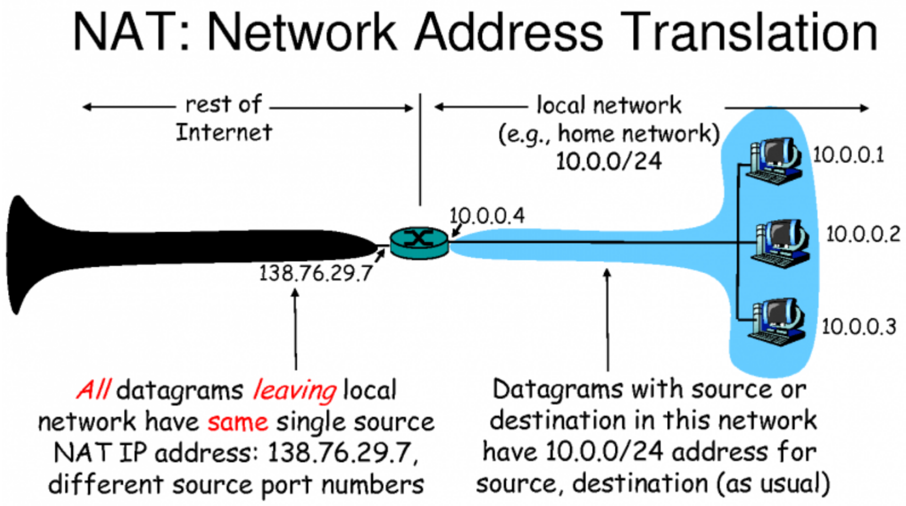

# 2025-12-02 Networks (Gísli)

1b = 1 bit.

1B = 1 byte = 8b.

So 16b = 2B.

The link layer provides node-to-node delivery on the same network.

The protocols involved are Ethernet, Wi-Fi, Bluetooth, USB, NFC, RFID, ...

Address: MAC (hardware) address

# The internet / network layer

What guarantees can/should a network offer?

- **Guaranteed delivery**: All packets sent will eventually arrive at the destination.
- **In order packet delivery:** Packets should arrive in the order that they are sent.
- **Guaranteed delivery within specified time**.
- **Guaranteed bandwidth:** The sending host should be guaranteed a specified bit rate (e.g., 1 Gigabit per ssecond (1 Gbps))
- **Security:** No eavesdropping. No diversion to different hosts. No undetected modifications.
Which guarantees are offered by the Internet (Internet Protocol - IP)? **NONE OF THE ABOVE!** Instead, it offers a “best-effort” delivery service.



Components of the IPv4 header:

- **Version (4 bits)**: IP version (IPv4 or IPv6)
- **Header Length (4 bits)**: Length of the header in 32-bit words
- **Type of Service (8 bits)**: Quality of service parameters
- **Total Length (16 bits)**: Total length of the IP packet (header + data) in bytes
- **Identification (16 bits)**: Unique identifier for fragmentation and reassembly
- **Flags (3 bits)**: Control flags for fragmentation
- **Fragment Offset (13 bits)**: Position of the fragment in the original packet
- **Time to Live (8 bits)**: Maximum number of hops the packet can take
- **Protocol (8 bits)**: Indicates the protocol used in the data portion (e.g., TCP, UDP)
- **Header Checksum (16 bits)**: Error-checking for the header
- **Source IP Address (32 bits)**: IP address of the sender
- **Destination IP Address (32 bits)**: IP address of the receiver
- **Options (variable length)**: Optional fields for additional functionality
- **Padding (variable length)**: Extra bytes to ensure the header is a multiple of 32 bits
- **Data (variable length)**: The actual payload being transported

IPv4 address: 32 bits (32b) (4 bytes (4B)).

<font color="#ff0000">172</font>.<font color="#00b050">16</font>.<font color="#00b0f0">254</font>.<font color="#7030a0">1</font> = <font color="#ff0000">10101100</font>.<font color="#00b050">00010000</font>.<font color="#00b0f0">11111110</font>.<font color="#7030a0">00000001</font> ← 4 blocks of 8 bits each (1 byte), so 4 bytes.

Each byte is represented as a decimal number (0-255).

Notionally, high end bits are network identifier, low end bits are host identifier. So for 198.0.1.130:

- Network ID: 198.0.1
- Host ID: 130

## Subnet addressing - Subnet mask

Subnetworks (subnets) are a logical divison of an IP network.

198.0.1.130/24 means that the first 24 bits are the network ID, and the last 8 bits are the host ID. 198.0.1/24 and 198.0.1.130/24 are the same network, because they have the same first 24 bits.

In more detail, the slash notation here (/24) is called CIDR (Classless Inter-Domain Routing) notation. It means that the first 24 bits of the IP address are used for the network portion, and the remaining bits (in this case, 8 bits) are used for the host portion. This allows for flexible allocation of IP addresses and efficient routing.

Subnet mask: A 32-bit number that masks an IP address and divides the IP address into network and host portions.

## IPv4 Reserved Addresses
- Some addresses are reserved for special purposes.
- Examples:
	- Localhost: 127.0.0.1 (actually the entire 127/8 range)
	- Local private networks: 10/8, 172.16/12, 192.168/16, ...
	- Multicast: 224. - 239. (Most significant 4 bits are 1110)
	- Limited (local) broadcast: 255.255.255.255/32
	- Complete list: [https://en.wikipedia.org/wiki/Reserved_IP_addresses](https://en.wikipedia.org/wiki/Reserved_IP_addresses)
These are not routable on the public Internet.

There aren’t enough IPv4 addresses for all devices connected to the Internet.

IPv4 only allows for about 4.3 billion (4.3 x 10^9) unique addresses.

## NAT: Network Address Translation
- A technique used to map multiple private IP addresses to a single public IP address (or a few addresses) before sending packets to another network (e.g., the Internet).
- Allows multiple devices on a local network to share a single public IP address.
- Helps conserve the limited number of available IPv4 addresses.
- Provides a layer of security by hiding internal IP addresses from the external network.
- Commonly used in home and office networks with routers that perform NAT.

Basically, all the devices in your *home* have *private* IP addresses (e.g., 192.168.1.x),

and your *router* has a *public* IP address assigned by your Internet Service Provider (ISP).

When a device in your home sends data to the Internet, the router translates the private IP address to its public IP address and keeps track of which internal device made the request.

When the response comes back, the router translates the public IP address back to the appropriate private IP address and forwards the data to the correct device.



Everyone on the internet doesn’t see the difference between multiple devices behind a NAT and a single device with a public IP address.

But there can only be 65000 simultaneous connections from the private network to the public network, because only 16 bits (2B) are used for port numbers.

### NAT: Usability vs. Security Impact
**Pros**:
- The “natural firewall” effect: Devices behind a NAT are not directly reachable from the outside, which can enhance security.
- Topology hiding: The internal network structure is hidden from external entities.
- IPv4 Conservation: NAT helps mitigate the shortage of IPv4 addresses by allowing multiple devices to share a single public IP address. This is part of the reason why IPv4 is still widely used despite the exhaustion of available addresses, and why the switch to IPv6 has been slow.
**Cons**:
- Breaks end-to-end connectivity: Some applications and protocols that rely on direct peer-to-peer connections may not work properly behind a NAT.
	- Peer-to-peer applications are when you connect directly to another user’s device, rather than going through a central server. Examples include file-sharing applications, VoIP services, and sometimes online gaming.
	- Examples of workarounds are things like STUN (Session Traversal Utilities for NAT) and TURN (Traversal Using Relays around NAT), which help establish connections between devices behind NATs.
- Loss of attribution: It can be difficult to trace the origin of traffic, which can complicate logging and monitoring.

> [!warning] NAT is *not* a security feature.
> NAT stops unsolicited incoming connections from the outside, but it does not provide encryption or protect against attacks from the inside.

The connections initiated from inside the NAT to the outside are tracked in a NAT table.

When a packet comes back from the outside, the NAT device looks up the destination port in the NAT table to determine which internal device should receive the packet.

But this means that unsolicited incoming connections from the outside to devices behind the NAT are generally not possible, unless specific port forwarding rules are set up on the NAT device.

In the NAT translation table, we have a mapping of internal IP addresses and ports to the external IP address and ports. There’s the WAN (Wide Area Network) side, which is the public IP address assigned to the NAT device (like a router), and the LAN (Local Area Network) side, which consists of the private IP addresses and ports of the devices behind the NAT.

When a device inside the NAT initiates a connection to an external server, the NAT device records this mapping in its translation table. For example, if an internal device with IP address

## Internet Routing

How do packets actually get to their destination across multiple networks?

**IGP**: Interior Gateway Protocol (within an autonomous system (AS)).

**EGP**: Exterior Gateway Protocol (between autonomous systems).

**BGP**: Border Gateway Protocol (the main EGP used on the Internet).

**AS**: Autonomous System, a collection of IP networks and routers under the control of a single organization that presents a common routing policy to the Internet.

Routing is done on the basis of these autonomous systems (ASes). Each AS is assigned a unique AS number (ASN).

The BGP is used to exchange routing information between ASes, allowing routers to determine the best path for data packets to reach their destination across the Internet.

Routers maintain a routing table that contains information about the paths to different network destinations. When a packet arrives at a router, the router examines the destination IP address and consults its routing table to determine the next hop for the packet. The packet is then forwarded to the next router along the path to its destination.

Interior Gateway Protocols (IGPs) are used within an AS to manage routing. Examples of IGPs include OSPF (Open Shortest Path First) and EIGRP (Enhanced Interior Gateway Routing Protocol).

### Routing Mechanics: Populating vs. Using the Routing Table
1. **Creating the table**
	1. **The goal**: build a map of the network. To know roughly where everything is. And each router needs to sort of learn this.
	2. **Input**: Updates from neighboring or statically configured routes.
	3. **Process**: Algorithms (e.g., Dijkstra’s, Bellman-Ford) to compute shortest paths.
		1. Dijkstra’s algorithm can’t be used in BGP because it requires complete knowledge of the distance between *all* the nodes, which is not feasible in the decentralized and dynamic environment of the Internet. BGP operates on a path-vector protocol, where each router shares information about the paths it knows to reach different networks, rather than requiring a complete map of the entire network.
		2. So they don’t use Dijkstra’s algorithm. They use Bellman-Ford, which is more suitable for distributed systems where each node only has knowledge of its immediate neighbors.
	4. **Result**: A forwarding table with next-hop information for each destination network.
	5. Inspect/modify with `route` / `Get-NetRoute` commands.
2. **Using the table**
	1. **The goal**: Move the packets *fast*.
	2. **Input**: An incoming packet’s destination IP address.
	3. **Process**: Lookup in the forwarding table to find the next hop (longest prefix match).
	4. **Result**: The packet is moved to the outbound interface towards the next hop. (Or dropped if no route is found.)

Some tools to see this on your machine:

- `traceroute` / `tracert`: Show the path packets take to a destination.
- `ping`: Test reachability of a host on an IP network.

The [Data Link Layer](../Terminology/Networks/OSI Model/2-Data Link Layer.md) uses [MAC](<../Terminology/Networks/MAC.md>) addresses to deliver frames within the same network.

“Frames” in this context means data packets at the link layer of the [OSI Model](../Terminology/Networks/OSI Model/OSI Model.md). So the ethernet frame is the data packet used in Ethernet networks at the link layer. Other frames include Wi-Fi frames, which are used in wireless networks.

The [MAC](<../Terminology/Networks/MAC.md>) address (Media Access Control address) is a unique identifier assigned to network interfaces for communications at the [Data Link Layer](../Terminology/Networks/OSI Model/2-Data Link Layer.md) of a network segment.

The [Network Layer](../Terminology/Networks/OSI Model/3-Network Layer.md) uses IP addresses to route packets between different networks.

## Border Gateway Protocol: BGP
- Used between routes of neighboring autonomous systems (ASes) to exchange routing information (info about available routes).
- Routing is based on local criteria, such as path attributes, not necessarily the shortest path (efficiency criteria).
	- E.g., company A has a peering agreement with company B, so it prefers routes through B even if they are longer.
	- Price of having traffic carried on a particular route.
	- Route length
	- Politics
- Data entry is often manual (network administrators configure routing policies, potential for human error).
- BGP lacks basic authentication and security features, making it vulnerable to various attacks (e.g., route hijacking).

Possible attack: BGP Hijacking.

BGP operates on trust. If a malicious AS advertises that it has the best route to a particular IP prefix, other ASes may accept this information and route traffic through the malicious AS. So an attacker can exploit the Longest Prefix Match rule to divert traffic.

- The attack: The victim announces 10.0.0.0./8. The attacker announces 10.1.0.0/16 (a sub-prefix of the victim’s prefix). Because of longest prefix match, traffic destined for it will be routed to the attacker.
- The result: Traffic interception, data theft, traffic analysis, denial of service.
- Mitigation: RPKI (Resource Public Key Infrastructure) to cryptographically verify route announcements

In 2008, Pakistan Telecom attempted to block access to YouTube within Pakistan by announcing a more specific route for YouTube’s IP address range (a /24 prefix) than the legitimate route announced by YouTube (a /22 prefix). However, this announcement was propagated beyond Pakistan’s borders, causing global traffic destined for YouTube to be misrouted to Pakistan Telecom. This incident resulted in a significant portion of global YouTube traffic being diverted to Pakistan, leading to widespread service disruption until the issue was resolved.

# Transport Layer
## TCP vs. UDP
**UDP (User Datagram Protocol):**
- Connectionless protocol. Fire-and-forget. No handshake, no confirmation.
- Fast, low overhead, no guarantees.
- Use cases: Streaming, gaming, VoIP, DNS queries. For when delivering *fast* is more important than delivering *reliably*.

**TCP (Transmission Control Protocol):**
- Connection-oriented protocol. **3-Way Handshake** (syn, syn-ack, ack) to establish a connection.
	- **SYN**: Client sends a SYN packet to the server to initiate a connection.
	- **SYN-ACK**: Server responds with a SYN-ACK packet to acknowledge the receipt of the SYN and to indicate its willingness to establish a connection.
	- **ACK**: Client sends an ACK packet back to the server to acknowledge the receipt of the SYN-ACK, completing the handshake.
- Guarnteed delivery, in-order delivery, flow control, congestion control.
- Use cases: Web browsing (HTTP/HTTPS), email (SMTP, IMAP), file transfer (FTP). For when *reliable* delivery is more important than *fast* delivery.

**Possible attacks:**
- **TCP SYN Flood**: An attacker sends a large number of SYN requests to a target server, but never finishes the handshake by sending the final ACK. This leaves the server with many half-open connections, consuming resources and potentially leading to a denial of service (DoS) for legitimate users.

# Application Layer
## The Web: HTTP vs. HTTPS
**HTTP (Port 80)**:
- Request/response protocol. (GET, POST, PUT, DELETE, ...)
- Stateless (each request is independent), cleartext (no encryption).
- Risk: Everything is visible to anyone who can intercept the traffic (e.g., passwords, cookies, personal data).
- Vulnerabilities: Anyone on the network path (in the same Wi-Fi or LAN) can eavesdrop (packet sniffing).

**HTTPS (Port 443)**:
- HTTP inside a TLS (Transport Layer Security) tunnel.
- Security: Encryption, integrity, authentication.
- Prevents listening in, but also Man-in-the-Middle attacks (if the attacker can’t get a valid certificate).
- Certificates: Issued by Certificate Authorities (CAs) to verify the identity of websites and enable secure connections.

## TLS (Transport Layer Security): Core Functions

Provides the security layer for many application layer protocols (e.g., HTTPS, FTPS, SMTPS).

1. Confidentiality (Encryption): Ensures that data exchanged between parties cannot be read by unauthorized entities. This is typically achieved using symmetric encryption algorithms (e.g., AES) after a secure key exchange.
2. Integrity (Hashing): Ensures that the data has not been altered during transmission. This is typically achieved using cryptographic hash functions (e.g., SHA-256) and message authentication codes (MACs).
3. Authentication (Identity): Verifies the identities of the parties involved in the communication. This is typically achieved using digital certificates issued by trusted Certificate Authorities (CAs) and asymmetric cryptography (e.g., RSA, ECC), Chain of Trust.

### TLS Handshake

The goal: safely agree on a shared secret key over an insecure wire.

- Asymmetric cryptography (public key) cryptography to exchange a symmetric session key.
	- Used only during setup.
	- Slow, high overhead.
	- Used for Diffie-Hellman key exchange or RSA encryption of the session key.
- Symmetric cryptography (Session key)
	- Used for the actual data transfer.
	- Fast, low overhead.
	- Used for encrypting the data exchanged during the session (e.g., AES).
	- The session key is derived from the key exchange process during the handshake.
- Steps:
  1. Client Hello: Client sends supported TLS versions, cipher suites, and a random nonce.
  2. Server Hello: Server responds with chosen TLS version, cipher suite, its digital certificate, and a random nonce.
  3. Key Exchange: Client and server perform a key exchange (e.g., Diffie-Hellman) to derive a shared session key.
  4. Finished: Both parties send a Finished message encrypted with the session key to confirm that the handshake was successful.
  5. Secure Communication: Subsequent data is encrypted using the agreed-upon session key.

## Remote Administration: SSH vs. Telnet
**Telnet (Port 23) - The legacy**:
- Obsolete protocol for remote administration.
- Flaw: Cleartext communication (no encryption).

**SSH (Port 22) - The modern replacement**:
- Secure Shell (SSH) protocol is the encrypted replacement for Telnet/FTP.
- Uses public key cryptography for authentication and symmetric encryption for data transfer.

**Security context: brute force**:
SSH is used on most servers for remote administration, making it the #1 target for brute-force attacks.
Brute-force attack: An attacker systematically tries all possible combinations of usernames and passwords until the correct one is found.
Mitigation strategies:
- Use strong, complex passwords.
- Implement account lockout policies after a certain number of failed login attempts.
- Use SSH keys for authentication instead of passwords.
- Change the default SSH port from 22 to a non-standard port to reduce exposure to automated attacks.

## Infrastructure: DNS & DHCP

Infrastructure protocols, technically application layer protocols, but not user-facing.

**[DNS (Domain Name System)](<../Terminology/Networks/DNS.md>) (Port 53)**:

- Translates human-readable domain names (e.g., www.example.com) into IP addresses.
- **Issue**: [UDP](<../Terminology/Networks/UDP.md>)/cleartext → vulnerable to spoofing, cache poisoning.
- **Various attacks**: Cache poisoning, DNS Tunneling, Amplification attacks, Typosquatting.
- **Mitigation**: DNSSEC (DNS Security Extensions) to provide authentication and integrity for DNS data.

**[DHCP (Dynamic Host Configuration Protocol)](<../Terminology/Networks/DHCP.md>) (Ports 67, 68)**:
- Automatically assigns IP addresses and other network configuration parameters to devices on a network.
- **Issue**: [UDP](<../Terminology/Networks/UDP.md>)/cleartext → vulnerable to spoofing, rogue DHCP servers.
- **Attack**: Rogue DHCP server can assign incorrect IP addresses or DNS servers to clients, leading to traffic interception or denial of service.
- **Mitigation**: Use DHCP snooping on switches to prevent unauthorized DHCP servers from operating on the network.

## Email

[SMTP (Simple Mail Transfer Protocol)](../Terminology/Networks/Transfer Protocols/SMTP.md) for sending email (Port 25, 587):

- Pushing mail from client to server or between servers.
- Vulnerability: Cleartext (no encryption), no authentication.

IMAP & POP3:

- Pulling mail from server to client (mail client on PC or phone).
- Vulnerability: Legacy versions are cleartext (no encryption), no authentication.
- Modern versions use TLS for encryption (IMAPS on Port 993, POP3S on Port 995).

Security context: Email Spoofing.

Because SMTP trusts the sender address in the email header, an attacker can send emails that appear to come from a legitimate source (e.g., a trusted company or individual). This can be used for phishing attacks, spreading malware, or other malicious activities.

- SPF/DKIM/DMARC: Email authentication protocols that help verify the legitimacy of the sender and protect against email spoofing.

## File Sharing
**[FTP (File Transfer Protocol)](../Terminology/Networks/Transfer Protocols/FTP.md) (Ports 20, 21):**
- For transferring files between client and server.
- **Vulnerability**: Cleartext (no encryption), no authentication.
- **Mitigation**: Always use SFTP (SSH File Transfer Protocol) or FTPS (FTP over TLS).

**SMB (Server Message Block) (Port 445):**
- For file and printer sharing in Windows networks.
- **Vulnerability**: Historically had many security issues, including vulnerabilities exploited by malware like WannaCry.
- **Mitigation**: Keep systems updated, disable SMBv1, use strong authentication methods.

**Security Context: Lateral Movement.**
- Lateral movement refers to the techniques attackers use to move deeper into a network after gaining initial access. Once inside, attackers may exploit vulnerabilities in protocols like SMB to access additional systems and resources within the network.
- E.g., EternalBlue exploit used in the WannaCry ransomware attack to spread rapidly across networks by exploiting a vulnerability in SMBv1.
- **Mitigation**: Disable SMBv1, apply patches, use strong authentication methods, and monitor network traffic for unusual activity.

## Interacting with Text-based Protocols (CLI)

Many older protocols are text-based (SMTP, HTTP, FTP, ...) and can be interacted with using command-line tools like `telnet` or `netcat (nc)`.

Example: Using `telnet` to interact with an [SMTP](<../Terminology/Networks/Transfer Protocols/SMTP.md>) server.

```bash
telnet mail.server.com 25
HELO attacker
MAIL FROM : <boss@corp.com>
RCPT TO : <victim@corp.com>
DATA
Subject : Fire!
Please help.
.
QUIT
```

### SMB

SMB (Server Message Block) is a binary protocol, so you can’t use `telnet` or `nc` to interact with it directly.

But you can use tools like `smbclient` to interact with SMB shares from the command line.

Example: Using `smbclient` to connect to an SMB share.

```bash
# 1. Enumeration ( List Shares )
$ smbclient -L //10.0.0.5 -N
# 2. Connection
$ smbclient //10.0.0.5/ C$ -U admin
Enter password :
smb : \ > ls
Windows D 0 ...
Program Files D 0 ...
smb : \ > get xyz
```

# Security
## Packet Filtering Firewalls

The Gatekeeper: Inspecting layer 3 ([IP](<../Terminology/Networks/TCP IP Model/IP.md>)) and layer 4 ([TCP](<../Terminology/Networks/TCP IP Model/TCP.md>)/[UDP](<../Terminology/Networks/UDP.md>)) headers of packets.

- Location: Usually at the network perimeter (between internal network and Internet).
- Logic: Compares packet headers against a set of rules (ACLs - Access Control Lists).
- Criteria:
	- Source & destination IP addresses.
	- Source & destination port numbers.
	- Protocol ([TCP](<../Terminology/Networks/TCP IP Model/TCP.md>), [UDP](<../Terminology/Networks/UDP.md>), <abbr title="Internet Control Message Protocol">ICMP</abbr>, ...).
	- Protocol header flags (e.g., TCP SYN, ACK, ...).
- Actions:
	- `ALLOW` (accept) the packet.
	- `DENY` (drop) the packet.
Default Deny: The final rule is to deny all traffic that does not match any previous rule, ensures that only explicitly allowed traffic is permitted.

## Virtual Private Network (VPN)

A VPN creates a secure, encrypted tunnel over a public network (like the Internet) to connect remote users or networks to a private network.

- Uses tunneling protocols (e.g., IPsec, OpenVPN, WireGuard) to encapsulate and encrypt data packets.
- **Goal**: Provide secure remote access to a private network.
- **Common protocols**: WireGuard, IPsec, OpenVPN.

**How it works: Encapsulation and encryption.**
1. **The original packet** (e.g., an [HTTP](<../Terminology/Networks/Transfer Protocols/HTTP.md>) request) is created by the client.
2. **Encryption**: The original packet is encrypted using a symmetric encryption algorithm (e.g., AES) with a session key.
3. **Encapsulation**: The encrypted packet is encapsulated within a new packet with a new header (e.g., an IPsec header).
4. **Transit**: The encapsulated packet is sent over the public network (Internet).
5. **Decapsulation**: The VPN server receives the encapsulated packet and removes the outer header.
6. **Decryption**: The VPN server decrypts the packet using the session key to retrieve the original packet.
7. **Delivery**: The original packet is forwarded to its intended destination on the private network.

# Tools
## CLI Tools: Connectivity & Path (Layer 3)

Diagnosing reachability and routing path issues.

| Function                                                                                                                                         | Usage Example                           |
| ------------------------------------------------------------------------------------------------------------------------------------------------ | --------------------------------------- |
| `ping`<br>Sends <abbr title="Internet Control Message Protocol">ICMP</abbr> Echo Requests to check if a host is online and measure latency (<abbr title="Round Trip Time">RTT</abbr>)                                                        | `ping google.com`<br>`ping 192.168.1.1` |
| `traceroute` (Linux) / `tracert` (Win)<br>Maps the path packets take to the destination by<br>incrementing TTL. Reveals where a connection dies. | `traceroute 8.8.8.8`                    |

## CLI Tools: Interface Configuration (Layer 2/3)

| Function                                                                                                   | Usage Example  |
| ---------------------------------------------------------------------------------------------------------- | -------------- |
| `ip addr` (Replaces `ifconfig`)<br>Shows IP addresses, Subnet Masks, and MAC addresses for all interfaces. | `ip addr show` |
| `ip route` (Replaces `route`)<br>Displays the kernel routing table and the Default Gateway.                | `ip route`     |
| `ip neigh` (Replaces `arp`)<br>Displays the ARP cache (Neighbor table).                                    | `ip neigh`     |

Windows PowerShell equivalents are `Get-NetIPAddress`, `Get-NetRoute`,

and `Get-NetNeighbor`.

## CLI Tools: Sockets (Layer 4) & DNS (Layer 7)

| Function                                                                              | Usage Example                                          |
| ------------------------------------------------------------------------------------- | ------------------------------------------------------ |
| `ss` (Replaces `netstat`)<br>Dump socket statistics. Fast way to see listening ports. | `ss -tunlp`<br>(TCP, UDP, Numeric, Listening, Process) |
| `dig`<br>Detailed DNS lookup. Shows TTL, flags, and exact answer section.             | `dig google.com MX`<br>`dig @1.1.1.1 google.com`       |
| `nslookup`<br>Simple name resolution (Windows/Linux).                                 | `nslookup google.com`                                  |

## CLI Tools: Security & Advanced Debugging

| Function                                                                                            | Usage Example                                                     |
| --------------------------------------------------------------------------------------------------- | ----------------------------------------------------------------- |
| `netcat` (`nc`)<br>Read/Write data across networks. Used for port scanning, chat, or file transfer. | `nc -v google.com 80`<br>`nc -l 1234` (Listen)                    |
| `wireshark`<br>GUI packet analyzer.                                                                 | `wireshark`                                                       |
| `tcpdump` / `tshark`<br>Command-line packet analyzers. Capture raw traffic for analysis.            | `tcpdump -i eth0 port 80 tshark -Y "http.request.method == POST"` |
| `nmap`<br>Network exploration tool. Scans for open ports and [OS](<../Terminology/Systems & Plaforms/Operating System.md>) versions.                           | `nmap -sV 192.168.1.1`                                            |

We’ll need `nmap` for today’s lab.

Be careful with the flags you use, some of them can be quite invasive.

Don’t scan machines you’re not allowd to.

Once you’ve used `ssh` to connect to a remote server, you can use various command-line tools to interact with the server securely. Here are some common tasks you might perform after establishing an SSH connection:

1. **File Transfer**: Use `scp` (secure copy) or `sftp` (SSH File Transfer Protocol) to transfer files between your local machine and the remote server.
	- Example using `scp`:
     ```bash
     scp localfile.txt user@remotehost:/path/to/destination/
     ```
	- Example using `sftp`:
     ```bash
     sftp user@remotehost
     sftp> put localfile.txt /path/to/destination/
     sftp> get /path/to/remotefile.txt localfile.txt
     sftp> exit
     ```
2. **Remote Command Execution**: Run commands directly on the remote server without logging in interactively.
	- Example:
     ```bash
     ssh user@remotehost 'ls -l /var/www/html'
     ```
3. **Port Forwarding**: Create secure tunnels for other network services using SSH port forwarding.
	- Example of local port forwarding:
     ```bash
     ssh -L 8080:localhost:80 user@remotehost
     ```
	- Example of remote port forwarding:
     ```bash
     ssh -R 9090:localhost:3000 user@remotehost
     ```
4. **Session Management**: Use tools like `tmux` or `screen` to manage multiple terminal sessions on the remote server.
	- Example using `tmux`:
     ```bash
     tmux new -s mysession
     ```
5. **System Monitoring**: Use commands like `top`, `htop`, `df`, `free`, and `uptime` to monitor system performance and resource usage.
	- Example:
     ```bash
     top
     ```
6. **Editing Files**: Use text editors like `vim`, `nano`, or `emacs` to edit configuration files or scripts on the remote server.
	- Example:
     ```bash
     vim /etc/nginx/nginx.conf
     ```
7. **Managing Services**: Use `systemctl` or `service` commands to start, stop, or restart services on the remote server.
	- Example:
     ```bash
     sudo systemctl restart nginx
     ```
8. **Checking Logs**: View system and application logs using commands like `tail`, `less`, or `cat`.
	- Example:
     ```bash
     tail -f /var/log/syslog
     ```

# Further studies
- UPnP, STUN etc punch holes into [NAT](<../Terminology/Networks/NAT.md>) to allow certain incoming traffic. Why can this be problematic for security? [find](<../Tools and Commands/Basic Bash commands/find.md>) some vulnerabilities of these techniques. How can they be countered?
- <abbr title="Secure Sockets Layer">SSL</abbr> Inspection: In a corporate environment, some firewalls can inspect [HTTPS](<../Terminology/Networks/Transfer Protocols/HTTPS.md>) traffic to look for [Malware](<../Terminology/Attacks/Malware/Malware.md>) (or leaked data). How is this possible given that [TLS](<../Terminology/Networks/TLS.md>) provides end-to-end encryption?
- [BGP](<../Terminology/Networks/BGP.md>) & The Chain of Trust: Discuss how [HTTPS](<../Terminology/Networks/Transfer Protocols/HTTPS.md>) (TLS) mitigates some of the problems of BGP hijacks. (Example: An attacker successfully hijacks a BGP prefix for a bank and diverts all traffic for the bank’s web server to a machine controlled by the attacker. Can they decrypt the traffic? Would the user notice? How?)
