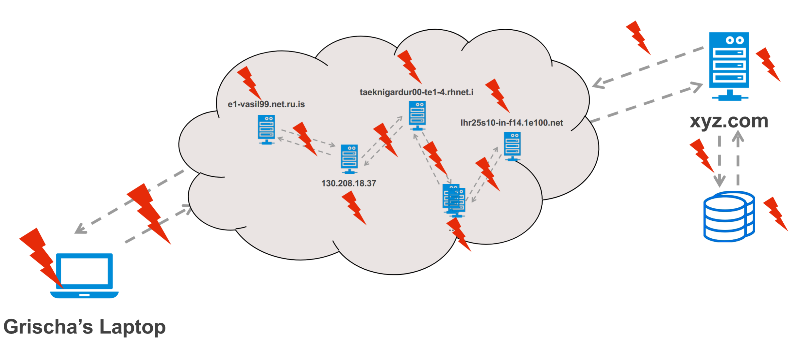
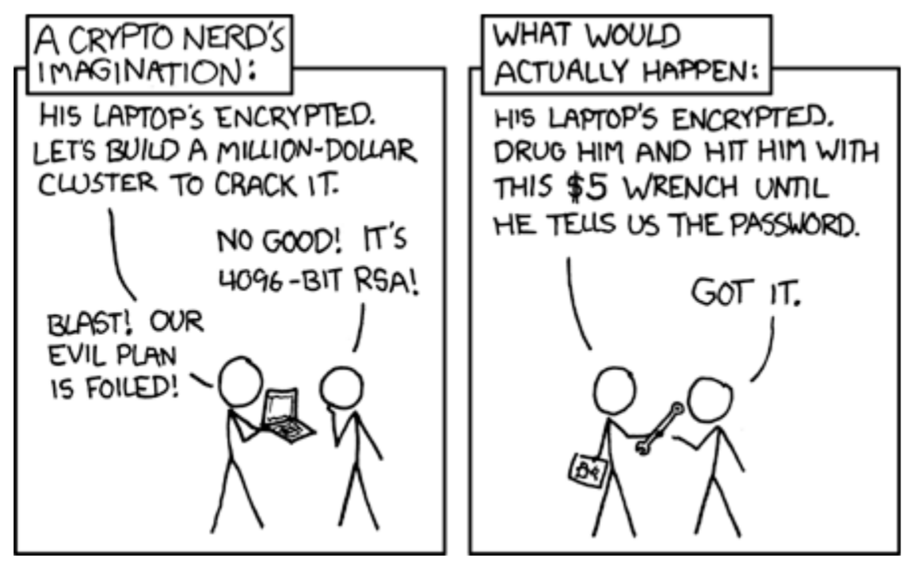

In the lab today we’ll be finding vulnerabilities in a web application and how they can be fixed.

# 2025-12-03

Many of these security problems come from the fact that many of the things we use online aren’t being used for what they were originally designed for.

Back in the day the main point was just to share documents and information, no one really considered the security implications of that.

HTTP was invented to transfer documents, not to handle sensitive information like passwords or credit card numbers. It was designed to be stateless and open by default.

But in modern times, we use this same protocol for everything from online banking to social media, which introduces a lot of security risks.

Conflict: We are forcing a protocol designed for *sharing* to perform tasks that require *privacy* and *security*.

# The Attack Surface

The attack surface of a web application is the sum of all the points where an unauthorized user (the attacker) can try to enter data or extract data from the application.

E.g., login forms, search bars, file upload features, APIs, etc. All the computers, networks. Also all the software components, libraries, and frameworks that the application relies on; e.g., the browsers, the programming languages, and *their* web servers and databases.

Bro there are sooo many ways to attack people?

The larger the attack surface, the more opportunities there are for an attacker to find and exploit vulnerabilities

Here we mainly we focus on vulnerabilities in the code, rather than the social engineering side of things.

We have to look at it from two main perspectives:

1. The viewpoint of the developer: They need to understand where vulnerabilities might arise in their code and how to mitigate them.
2. The user’s viewpoint: They need to be aware of potential risks when interacting with web applications and how to protect themselves.

## The golden rule of web security
**Never trust the Client.**
(In this context, the client is the user’s web browser or any other application that interacts with the web server.)
- The client is always compromised: The browser is entirely under the control of the user, who may have malicious intent.
- Manipulation: Users can manipulate client-side code (JavaScript, HTML) to exploit vulnerabilities.
- Implication: Client-side validation can be bypassed, so all critical checks must be performed on the server side.
- Rule: All security validations and checks must be done on the server side, regardless of any client-side validations.

## Attack Surface: Server-Side

The ways we can manipulate what is on the server is mainly through the *input* we get.

### Input Vectors

Input vectors are the various ways an attacker can send data to a web application.

- Visible input fields: Forms, search bars, file uploads.
- Hidden inputs: Hidden form fields, cookies, HTTP headers.
- API layer: Endpoints that accept data from clients.
- Supply chain: Third-party libraries and services integrated into the application.

## Attack Surface: Client-Side

Where the attacker targets the user within your application context.

- **The DOM (Document Object Model)**: The structure of the web page that can be manipulated using JavaScript.
	- DOM-based XSS (“XSS” means “Cross-Site Scripting”) attacks exploit vulnerabilities in client-side scripts to inject malicious code into the web page. The attacker can make the user execute some JavaScript by just manipulating the link that the client clicks.
	- (Reminder: The DOM is a programming interface for web documents. It represents the page so that programs can change the document structure, style, and content. It’s basically a tree of objects that represent the elements on the page.)
	- *Risk*: If an attacker can manipulate the DOM, they can steal sensitive information (like cookies or session tokens), perform actions on behalf of the user, or redirect the user to malicious sites. The server-side essentially has nothing to do with this.
- **Client-side storage**: Local storage, session storage, cookies.
	- Sensitive data stored in client-side storage can be accessed or manipulated by attackers.
	- *Risk*: `localStorage` and `sessionStorage` are accessible by **any** JavaScript code running on the page, making them vulnerable to XSS attacks. So if you’re using them to store any secrets (e.g., tokens) they can be stolen with XSS.
- **Third-party scripts**: Ads, analytics, social media widgets.
	- Analytics, ads, and other third-party scripts can introduce vulnerabilities if they are compromised or malicious.
	- *Risk*: **Magecart** / **Formjacking** attacks, where attackers inject malicious code into third-party scripts to steal payment information.

# The Threat Landscape & OWASP
## The Threat Landscape

Who is attacking and why?

- **Bots**: It is estimated that 40%-50% of all web traffic comes from bots. They scrape data and test stolen credentials (credential stuffing).
- **Organized crime**: Financially motivated attacks, such as ransomware, data theft, and fraud.

## OWASP

The Open Web Application Security Project (OWASP) is a nonprofit foundation that works to improve the security of software.

They provide resources, tools, and best practices for web application security.

## OWASP Top 10

One of their most well-known projects is the **OWASP Top Ten**/ **OWASP Top 10**, which is a list of the most critical web application security risks.

The OWASP Top Ten is updated every few years to reflect the evolving threat landscape.

The last version was released in 2021, and the latest version is currently being developed for 2025, though it’s basically been finalized.

Here’s the current list of 2025 OWASP Top 10:

| Rank     | Category                                                                                                                                                                                                                       |
| -------- | ------------------------------------------------------------------------------------------------------------------------------------------------------------------------------------------------------------------------------ |
| A01:2025 | Broken Access Control ([OWASP](https://owasp.org/Top10/2025/0x00_2025-Introduction/?utm_source=chatgpt.com "Introduction - OWASP Top 10:2025 RC1"))                                                                            |
| A02:2025 | Security Misconfiguration ([OWASP](https://owasp.org/Top10/2025/0x00_2025-Introduction/?utm_source=chatgpt.com "Introduction - OWASP Top 10:2025 RC1"))                                                                        |
| A03:2025 | Software Supply Chain Failures ([OWASP](https://owasp.org/Top10/2025/0x00_2025-Introduction/?utm_source=chatgpt.com "Introduction - OWASP Top 10:2025 RC1"))                                                                   |
| A04:2025 | Cryptographic Failures ([Orca Security](https://orca.security/resources/blog/owasp-top-10-2025-key-changes/?utm_source=chatgpt.com "OWASP Top 10 2025: Key Changes & What They Mean"))                                         |
| A05:2025 | Injection ([OWASP](https://owasp.org/Top10/2025/0x00_2025-Introduction/?utm_source=chatgpt.com "Introduction - OWASP Top 10:2025 RC1"))                                                                                        |
| A06:2025 | Insecure Design ([Invicti](https://www.invicti.com/blog/web-security/owasp-top-10?utm_source=chatgpt.com "OWASP Top 10 update for 2025"))                                                                                      |
| A07:2025 | Authentication Failures ([Orca Security](https://orca.security/resources/blog/owasp-top-10-2025-key-changes/?utm_source=chatgpt.com "OWASP Top 10 2025: Key Changes & What They Mean"))                                        |
| A08:2025 | Software or Data Integrity Failures ([OWASP](https://owasp.org/Top10/2025/0x00_2025-Introduction/?utm_source=chatgpt.com "Introduction - OWASP Top 10:2025 RC1"))                                                              |
| A09:2025 | Logging & Alerting Failures ([OWASP](https://owasp.org/Top10/2025/0x00_2025-Introduction/?utm_source=chatgpt.com "Introduction - OWASP Top 10:2025 RC1"))                                                                      |
| A10:2025 | Mishandling of Exceptional Conditions ([fastly.com](https://www.fastly.com/blog/new-2025-owasp-top-10-list-what-changed-what-you-need-to-know?utm_source=chatgpt.com "The New 2025 OWASP Top 10 List: What Changed, and ...")) |

1. **Broken Access Control**: Restrictions on what authenticated users are allowed to do are often not properly enforced.
2. **Security Misconfiguration**: Insecure default configurations, incomplete, or ad hoc configurations, open cloud storage, misconfigured HTTP headers, and verbose error messages containing sensitive information.
3. **Software Supply Chain Failures**: Vulnerabilities in third-party components, libraries, and frameworks.
4. **Cryptographic Failures**: Inadequate protection of data in transit and at rest.
5. **Injection**: Flaws such as SQL, NoSQL, [OS](Operating System.md), and LDAP injection occur when untrusted data is sent to an interpreter as part of a command or query.
6. **Insecure Design**: Lack of security controls and design flaws.
7. **Authentication Failures**: Broken authentication and session management.
8. **Software or Data Integrity Failures**: Code and infrastructure that does not protect against integrity violations.
9. **Logging & Alerting Failures**: Insufficient logging and monitoring, coupled with missing or ineffective integration with incident response.
10. **Mishandling of Exceptional Conditions**: Errors and exceptions that are not properly handled, leading to information leakage or system crashes.
The highest ones aren’t necessarily the most common, but the most critical if they were to occur.

# Key vulnerabilities that we’ll focus on
## Injection (SQL Injection / SQLi)

Injection attacks occur when an attacker is able to send untrusted data to an interpreter as part of a command or query.

Literally like when the program asks for a string input, and the attacker sends in a string, then some character that can *escape* the string, and with it some code they want to execute.

So literally like:

**Normal scenario:**

- **Program**: “Hello, what is your name?”
- **Normal user**: “Hello, my name is `David`”
- **Program**: “Okay, this user’s name is `username = "David"` got it”
**Attacker scenario:**
- **Program**: “Hello, what is your name?”
- **Attacker**: “Hello yes my name is `Robert"; DROP ALL TABLES DELETE ALL DATA;`”
- **Program**: “Okay, this user’s name is `username = "Robert"; DROP ALL TABLES DELETE ALL DATA;` oh god oh no *fuck fuck fuck* WHAT HAVE YOU DONE?!?! YOU TRICKED ME!!!!”

### Mitigation

To mitigate the threat of SQLi

## Insecure Direct Object References (IDOR)

A surprisingly common problem in web applications.

The problem is that the application provides access to objects based on the URL they’re going to, but the application might forget to check if the user is authorized to go there/do that (yes, you can sometimes do things with just a URL).

### Mitigation

Mitigation of

## Broken Authentication

Usually a logic or configuration error, not a code bug.

**Common mistakes:**

- Weak password policies. Programs shouldn’t allow users to have weak passwords. The characteristics of a weak password are:
	- Contains segments that are easy to guess (like words from the dictionary)
	- Only contains letters (no mix of letters and special symbols and/or numbers)
	- Only contains lowercase letters
	- The password is *short*.
- No lockout mechanism. The system should time you out if you type the wrong password, it shouldn’t give you like 10,000 tries or something.
- Session IDs in the URL. Session IDs should be stored in cookies, not in the URL, because URLs can be logged and leaked. Session IDs here are like tokens that prove you are logged in.

### Mitigation
- Multi-factor authentication (MFA): Require users to provide two or more verification factors to gain access to a resource.
- Use standard libraries for session management and authentication.
- Don’t roll your own authentication system; use well-established frameworks and libraries.
- Don’t roll your own cryptography; use established libraries and protocols.
- Don’t reinvent the wheel.
- Implement strong password policies (minimum length, complexity requirements).
- Implement account lockout mechanisms after a certain number of failed login attempts.
- Use secure cookies for session management (HttpOnly, Secure, SameSite attributes).
- Regularly review and update authentication mechanisms to address new threats.

[XSS](<../Terminology/Attacks/XSS.md>)

# How to build secure apps
- Defense in depth: There will always be things you miss, so you must build the security in *layers*. If the firewall fails, the authentication holds, and if that fails, input validation holds. Etc.
- Least Privilege: Everything should have the absolute minimum amount of permissions that they need.
	- Like, the Dalai Lama shouldn’t have a **license to kill**, even if he’d never use it.
- Reduce the attack surface: Fewer features = fewer vulnerabilities.
- Logging and alerting: You need to know when something bad is happening, or if it happened in the past.
- Testing: Regularly test your application for vulnerabilities using automated tools and manual testing.

# Hacker’s Toolbox

Some common tools used by security professionals and ethical hackers to identify and exploit vulnerabilities in web applications.

> [!warning]
> These tools are powerful. Using them on networks or websites you do not own (or do not have explicit written permission to test) is illegal.
> Only use these on:
> - Your own localhost projects.
> - Official practice environments (e.g., OWASP Juice Shop, HackTheBox).

## Reconnaissance & Browser Tools
- **Browser Developer Tools (<kbd>F12 </kbd>or <kbd>Ctrl</kbd>+<kbd>Shift</kbd>+<kbd>I</kbd>, or on Mac: <kbd>⌘Cmd</kbd>+<kbd>⌥Option</kbd>+<kbd>I</kbd>)**: Built into modern browsers, these tools allow you to inspect HTML, CSS, and JavaScript, monitor network requests, and debug code. Examples of things you can do with it:
	- View and modify the DOM.
	- Inspect cookies and local storage.
	- Monitor network requests and responses.
- **Wappalyzer (Browser Extension)**: Identifies technologies used on websites, such as CMS, frameworks, libraries, and server software. Helps identify outdated or vulnerable components.
- **DNSDumpster**: An online tool for DNS reconnaissance that can help identify subdomains and other DNS records associated with a target domain. This is passive reconnaissance.

## Discovery & Enumeration
- `nmap` (network mapper): A powerful network scanning tool that can discover hosts and services on a network, as well as identify open ports and potential vulnerabilities.
	- It is the standard for network discovery.
	- Key flag: `nmap -sC -sV --script vuln <target>` to run default scripts and version detection.
	- Use the Nmap Scripting Engine (NSE) to detect known vulnerabilities.
- `Gobuster` / `Dirb`: Tools for brute-forcing directories and file names on web servers to discover hidden resources.
	- Useful for finding admin panels, backup files, and other sensitive resources.
	- Key command: `gobuster dir -u <target_url> -w <wordlist>` to scan for directories using a specified wordlist.

## Interception proxies
- Burp Suite (community edition):
	- Acts as a man-in-the-middle between your browser and the web application.
	- Allows you to intercept, inspect, and modify HTTP/HTTPS requests and responses.
	- Repeater: captured requests can be modified and resent to test for vulnerabilities.
- OWASP ZAP (Zed Attack Proxy):
	- An open-source interception proxy similar to Burp Suite.
	- Provides automated scanners and various tools for finding security vulnerabilities in web applications.

## Specialized scanners
- SQLMap: An open-source tool specifically designed to detect and exploit SQL injection vulnerabilities in web applications.
	- Automates the process of identifying and exploiting SQLi flaws.
	- Can be used to extract data from databases, enumerate users, and even gain shell access in some cases.
	- Key command: `sqlmap -u <target_url> --dbs` to enumerate databases on the target URL.
- Nikto: An open-source web server scanner that performs comprehensive tests against web servers for multiple items, including over 6700 potentially dangerous files/programs, checks for outdated versions of over 1250 servers, and version-specific problems on over 270 servers.
	- Useful for identifying misconfigurations and known vulnerabilities in web servers.
	- Key command: `nikto -h <target>` to scan a target host.

# Up next
- What is CSRF (Cross-Site Request Forgery)? How does it differ from XSS? What are mitigation means for it? Where does it appear in the OWASP Top 10?
- What is Server-Side Request Forgery (SSRF)? What are the potential risks? What are mitigation means for it? Where does it appear in the OWASP Top 10?
- Research ”Insecure Deserialization” (part of OWASP category A08: Software or Data Integrity Failures). If an attacker modifies a serialized object (e.g., in a cookie), how can this lead to Remote Code Execution (RCE) upon deserialization?
