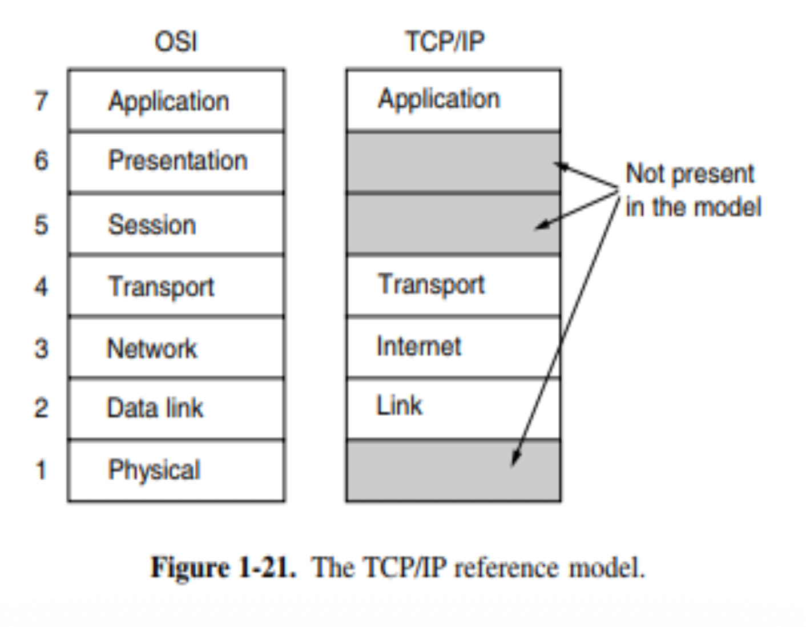

# 2025-12-11 Summary (Fuad)
- The sum of all potential vulnerabilities in a system where an attacker could try to subvert the intended purpose of the system and the organization or person who is using it.
**Defense in Depth**
- Risk = Threat × Vulnerability × Cost Strategies for Handling Risk:
- Mitigate/Reduce: Reduce the likelihood or impact to an acceptable level.
- Avoid: Discontinue the risky activity (e.g., ”We will not store credit card numbers”).
- Accept: The cost of the fix > impact. Management signs off.
- Transfer risk to a 3rd party (e.g., Cyber Insurance, Cloud Provider).

Network:
- Packets may take any path through the network, reassembled by the receiver.
- Nmap - scans open port
